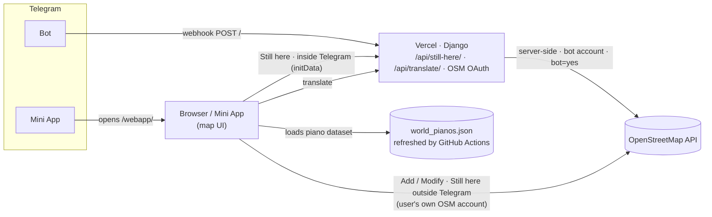

# Telegram Piano Map Bot

Telegram Mini App to find, map and update public pianos (`amenity=piano`) on **OpenStreetMap**.
Built with **Django**, hosted on **Vercel**.

## How it works



- **Inside Telegram**, the **Still here** button updates `survey:date` server-side with the bot's own OSM account (no login needed).
- **Outside Telegram** (or for Add/Modify), edits go directly to the OSM API with the **user's own OSM account** (login via Settings → Connect OSM).
- The piano dataset (`world_pianos.json`) is regenerated periodically by a scheduled GitHub Action.

## Run locally

```bash
source .venv/bin/activate
python manage.py runserver 3000
```

**OR**

 If you have Vercel CLI installed, you can emulate the serverless environment with:
```bash
vercel dev --listen 3000
```
*(Or use `npx vercel dev --listen 3000` if you want to run it via npm without installing globally).*


Kill the local server with:

```bash
lsof -ti :3000 | xargs kill -9
pkill -f "manage.py runserver"
pkill -f "vercel dev"
```

## Environment variables

| Variable | Purpose |
| :--- | :--- |
| `TOKEN` | Telegram bot token (webhook + initData validation) |
| `WEBAPP_URL` | Public URL of the Mini App, e.g. `https://…vercel.app/webapp/` |
| `OSM_BOT_ACCESS_TOKEN` | OSM OAuth token of the **bot account** (server-side "Still here") |
| `OSM_CLIENT_ID` / `OSM_CLIENT_SECRET` | OSM OAuth app used for the user login |
| `OSM_REDIRECT_URI` | OSM OAuth callback URL |

## Webhook

```bash
curl -F "url=https://your-app.vercel.app/" https://api.telegram.org/bot$TOKEN/setWebhook
```

## API endpoints

| Route | Purpose | Auth |
| :--- | :--- | :--- |
| `POST /` | Telegram webhook | Telegram |
| `GET /webapp/` | Mini App page | – |
| `POST /api/translate/` | Description translation | signed page token |
| `POST /api/still-here/` | Set `survey:date` to today via the bot account | Telegram initData |
| `GET /api/osm/start/`, `GET /api/osm/callback/` | OSM OAuth 2.0 PKCE login | – |

## "Still here" security

- Only elements tagged `amenity=piano` are touched; the written date is always today.
- Repeated confirmations on the same day are acknowledged but **not written** (no changeset).
- 150 m proximity check enforced server-side; per-user rate limit; `bot=yes` on the changeset.
- Inside Telegram the request must carry valid `initData` (HMAC-signed by Telegram), so only real Mini App users can call the endpoint.
